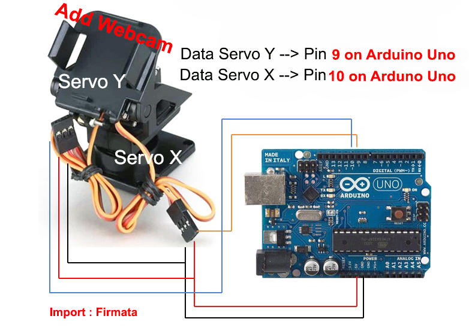

# Face Detection and Servo Control System

This project combines face detection using OpenCV with servo control via Arduino. The system detects a face in the webcam feed and sends commands to an Arduino to move servos based on the position of the detected face.

## Components

- **Hardware:**

  - Arduino Uno = 1 unit
  - Pan Tilt Servos (for X and Y axes) Type --> SG90 = 2 unit
  - Webcam = 1 unit
  - USB Cable USB Type-A (Printer Cable)
  - Connecting Wires (enought).

- **Software:**

  - OpenCV (for face detection in Python)
  - Arduino IDE (for servo control)
  - Python (for communication between Python and Arduino)

- Face-Detection (requiments):
  - Python v3.8.5
  - pip v20.2.2
  - opencv v4.3.0
  - numpy v1.19.1
  - pyserial v3.4

## Schema Wiring Hardware Servo and Arduino Uno:



## How It Works

1. **Face Detection (Python):**

   - Uses OpenCV to capture video from a webcam.
   - Detects faces in the video feed.
   - Calculates the position of the detected face.
   - Sends commands to Arduino via serial communication to move servos based on the face position.

2. **Servo Control (Arduino):**
   - Receives commands from Python over serial communication.
   - Moves servos to follow the detected face position based on received commands.

## Python Code

```python
import numpy as np
import serial
import time
import cv2

# Adjust COM port as needed
ard = serial.Serial('COM4', 9600)
time.sleep(2)
print("Connected to Arduino...")

# Load the face detection model
face_cascade = cv2.CascadeClassifier('haarcascade_frontalface_default.xml')

# Capture video from webcam
vid = cv2.VideoCapture(0)

while True:
    _, frame = vid.read()
    gray = cv2.cvtColor(frame, cv2.COLOR_BGR2GRAY)

    faces = face_cascade.detectMultiScale(gray, minSize=(80, 80), minNeighbors=3)

    for (x, y, w, h) in faces:
        cv2.rectangle(frame, (x, y), (x+w, y+h), (255, 0, 0), 2)
        Xpos = x + (w / 2)
        Ypos = y + (h / 2)

        if Xpos > 280:
            ard.write('R'.encode())
        elif Xpos < 360:
            ard.write('L'.encode())
        else:
            ard.write('S'.encode())

        if Ypos > 280:
            ard.write('U'.encode())
        elif Ypos < 200:
            ard.write('D'.encode())
        else:
            ard.write('S'.encode())
        break

    text = "Ypos = " + str(Ypos) + " Xpos = " + str(Xpos)
    cv2.putText(frame, text, (10, 20), cv2.FONT_HERSHEY_SIMPLEX, 0.9, (0, 255, 255), 1)
    cv2.imshow('frame', frame)

    if cv2.waitKey(1) & 0xFF == ord('q'):
        break

cv2.destroyAllWindows()
ard.close()
vid.release()
```

## Arduino Code:

```cpp
#include <Servo.h>

Servo servoX; // Servo for X axis
Servo servoY; // Servo for Y axis
int x = 90;   // Initial angle for servo X
int y = 90;   // Initial angle for servo Y

void setup() {
  Serial.begin(9600);
  servoX.attach(9);
  servoY.attach(10);
  servoX.write(x);
  servoY.write(y);
  delay(1000);
}

void loop() {
  if (Serial.available()) {
    char input = Serial.read();

    // Control servoY
    if (input == 'U' && y < 180) {
      servoY.write(++y);
      delay(15);
    } else if (input == 'D' && y > 0) {
      servoY.write(--y);
      delay(15);
    }

    // Control servoX
    if (input == 'L' && x > 0) {
      servoX.write(--x);
      delay(15);
    } else if (input == 'R' && x < 180) {
      servoX.write(++x);
      delay(15);
    }
  }
}

```

## Setup Instructions

1. Hardware Setup:

   - Connect the servos to the Arduino pins as specified in the code.
   - Connect the Arduino to your computer via USB.

2. Software Setup:

   - Install the necessary libraries (OpenCV for Python, Servo for Arduino).
   - Upload the Arduino code to the Arduino board using the Arduino IDE.
   - Run the Python script on your computer.

3. Running the System:
   - Ensure the webcam is properly connected and working.
   - Start the Python script to begin face detection.
   - The servos will move based on the detected face position.

## Notes

1. Adjust the COM port in the Python script to match your system's configuration.
2. Ensure that the haarcascade_frontalface_default.xml file is in the same directory as the Python script or provide the correct path.

## Troubleshooting

- If the servos do not respond, check the connections and ensure the Arduino is correctly receiving commands.
- Ensure the correct COM port and baud rate are set for serial communication.
  <br/>
  For further assistance, please consult the documentation for OpenCV, Arduino, and the respective libraries used.
  <br/>
  Happy coding!
  <br/>
"# Face-Detection-and-Servo-Control-System" 
